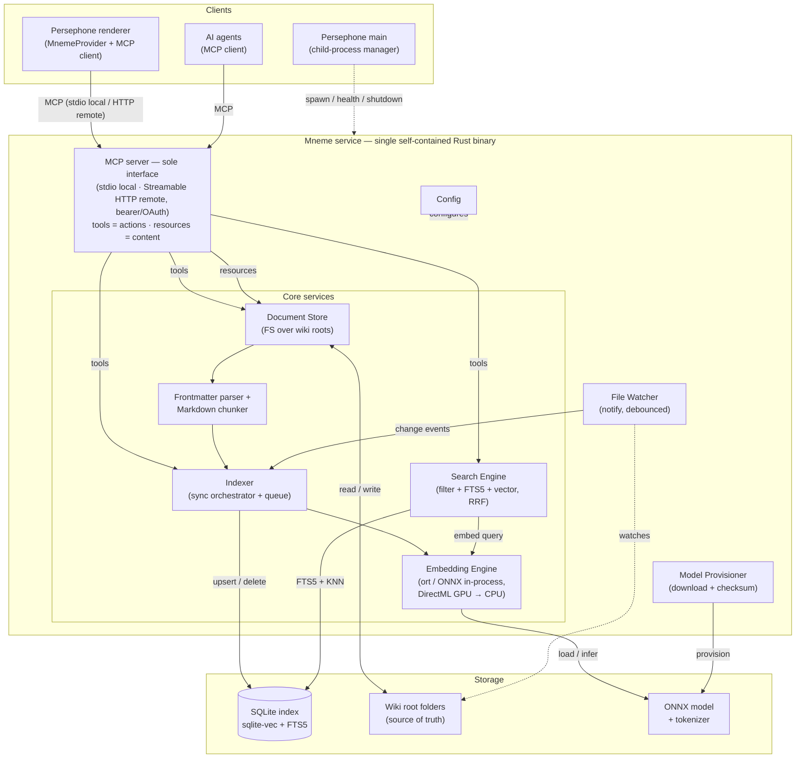
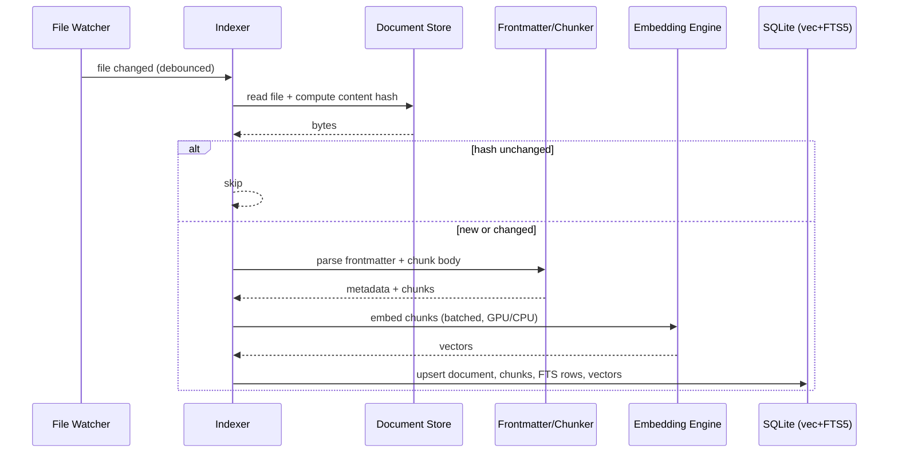
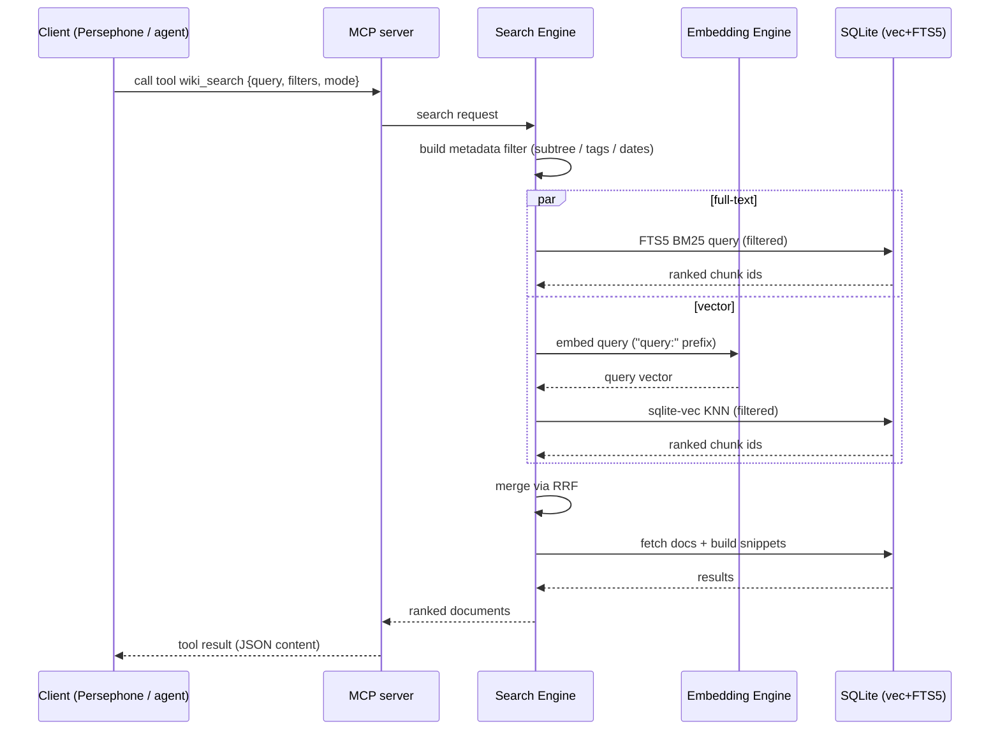

# US-651: Mneme — App architecture

**Epic:** [EPIC-032 — Mneme (Wiki / Vector Memory service)](../../epics/EPIC-032.md)
**Status:** In progress (design) — this task DEFINES the architecture; no service code is written here.
**Created:** 2026-06-13

## Goal

Define and document the architecture of **Mneme**, the standalone knowledge-base service: its process model, internal components and their responsibilities, the storage layout, the main data flows (indexing and search), the technology choices per component, and the integration boundary with Persephone. The deliverable is this document plus the architecture diagram — the reference that later implementation tasks build on.

## Background

Mneme is decided to be **built in-house** (EPIC-032, Option A) as a single self-contained **Rust** binary. Firmed-up decisions from the epic that this architecture must realize:

- **D2** files-as-truth: markdown + YAML frontmatter on disk is canonical; the index is derived and rebuildable.
- **D3** Rust, single self-contained exe (minimal install).
- **D4** index = SQLite + `sqlite-vec` + FTS5, one `.db` file.
- **D5** embeddings = `gte-multilingual-base` (int8 ONNX) via the `ort` crate; pluggable; model name/version recorded in the index.
- **D6** local inference by default (privacy).
- **D7** hybrid search: FTS5 (BM25) + vector top-K merged with Reciprocal Rank Fusion; filters as SQL predicates.
- **D8** chunk markdown by headings with a size cap.
- **D9** single MCP interface (no REST): tools = actions, resources = content; stdio locally, Streamable HTTP (bearer/OAuth) for networked/Azure.
- **D10** native MCP server on Mneme from the start (the sole interface); Persephone consumes it via its MCP client + a `MnemeProvider` in the content pipeline.
- **D11** model downloaded on first enable; FTS works before the model arrives.
- **D12** multiple independent wiki roots.
- **D15** GPU via the DirectML execution provider when available, CPU fallback.

## Process model (the key decision)

**One process. The embedding model runs in-process.** ONNX Runtime is linked into the Mneme binary through the `ort` crate, so the model is a file loaded at startup and inference happens inside the service — **no separate embedding application, no Ollama, no Python, no model daemon**. This is the whole point of the ONNX + `ort` choice and is what makes "one exe, minimal install" possible.

- Inference runs on a **blocking worker pool** (e.g. `tokio::task::spawn_blocking` / a dedicated worker), so embedding never blocks the async HTTP server. Bulk indexing feeds a batched work queue.
- GPU acceleration (DirectML) and CPU both run in-process — only the ONNX Runtime execution provider differs.
- The model (~324 MB) is **not** compiled into the binary; it is downloaded on first run into a cache dir. The binary stays small.

**Rejected alternative (recorded):** a separate embedding process (Ollama / llama.cpp server / Python `sentence-transformers` sidecar). It would add an install dependency and a second process lifecycle to manage, defeating minimal-install. Revisit only if a GGUF-only model that `ort` cannot load is ever required — and even then the `Embedder` trait (below) localizes the change.

## Component diagram

See [`mneme-architecture.mmd`](mneme-architecture.mmd) — the **canonical** diagram (open in Persephone's Mermaid viewer); the copy below is kept in sync with it:



## Components and responsibilities

### Interface — a single MCP server (sole protocol)

Mneme exposes **one interface: an MCP server**, consumed identically by Persephone and AI agents — the contract is defined once. No REST/second protocol. (Decided 2026-06-13; see epic D9/D10.)

- **Tools = actions (data plane), shaped after an agent's own tools** so the wiki feels native. **File-like:** `wiki_read` (≈Read), `wiki_write` (≈Write — `content` = the *whole file*, frontmatter as YAML text; **no** separate frontmatter param), `wiki_edit` (≈Edit — exact string replace), `wiki_glob` (≈Glob — find by path pattern), `wiki_grep` (≈Grep — literal/regex match, optional `tags`/`dateRange`), `wiki_delete`. **Semantic:** `wiki_search`, modeled on **WebSearch** (query → ranked results with title + `mneme://` link + snippet; filters: `subtree`, `tags`/`excludeTags`, `dateRange`, `mode`, **`ext`** — defaults to `.md`, array or `".*"` for other indexed types) — kept separate from `wiki_grep` because the result shapes differ. **Views:** `wiki_tree`, `wiki_timeline`, `wiki_tags` (distinct tags + counts). Self-describing via JSON schema — discoverable by agents and testable in Persephone's MCP Inspector. **Root is embedded in the path, not a separate parameter:** every document address is `{root}/{path}` (matching the resource URI `mneme://{root}/{path}`; `root` = registered root name) — globally unique, self-contained links. Path tools (`wiki_read`/`write`/`delete`) take that full path; `wiki_search`/`wiki_tree`/`wiki_timeline`/`wiki_tags`/`wiki_reindex` take an optional `{root}/…` path prefix to scope and span **all roots** when omitted. `wiki_remove_root`/`wiki_index_delete` identify a root by name; `wiki_add_root { folder, name? }` registers one.
- **Tool result shapes:** `wiki_read` → document text + parsed frontmatter; `wiki_search` → ranked `{ uri, title, tags, snippet, score }`, **one result per document** (best-ranking chunk wins the snippet; `topK` default 10, `mode` default `hybrid`); `wiki_grep` mirrors Grep output modes (`files_with_matches` / `content` with line + context / `count`), run as a **streaming scan over the indexed file set** (regex-capable; **not** FTS5); `wiki_glob` → matching `{root}/{path}` list; `wiki_tree` → flat `{ uri, name, isDir, depth }` (depth-first — trivial to render as a tree or consume programmatically); `wiki_timeline` → `{ uri, title, date, tags }` newest-first (entries = files carrying the `log` tag; `date` parsed from the `YYYY-MM-DD` filename, not `created`); `wiki_tags` → `{ tag, count }`. `wiki_glob`/`wiki_grep` cover **indexed files only**; binary attachments are reached via `resources/read`, never glob/grep.
- **Tools = management (control plane):** `wiki_add_root`, `wiki_remove_root`, `wiki_list_roots`, `wiki_reindex`, `wiki_model_update`, `wiki_status` (roots, **index inventory** — versioned DBs + sizes — model, reindex progress), `wiki_index_delete` (remove a stale/inactive versioned DB). Long operations (`wiki_reindex`, `wiki_model_update`) emit **MCP progress + log notifications** so Persephone can show live progress; `mneme://status` may also be a subscribable resource.
- **Access model (D16):** agents get **full access** to *all* tools — data and management alike — so the assistant can fully help the user (initialize roots, update the model, etc.). No hidden methods. Per-client scoping (by transport / auth scope, server-side filter + denial) is a **retained optional capability** for future remote/multi-tenant or read-only-guest needs, not enforced now.
- **Resources = content:** documents and **binary attachments** addressed by URI (`mneme://{root}/{path}`), fetched via MCP `resources/read`. This is how images embedded in markdown are served — Persephone reads them through `MnemeProvider` (see integration boundary). Binary travels as base64 inside JSON-RPC (~33% inflation) — fine for Mneme's attachment scope (diagrams, PDFs, office files; **not** large media/video, which is out of scope). No escape-hatch needed. Resources are **subscribable** (`resources/subscribe` + `notifications/resources/updated`) so an open document **live-refreshes** when it changes (agent `wiki_write` or any watcher-detected disk edit); `notifications/resources/list_changed` signals tree add/remove/rename — see integration boundary.
- **Transport:** the MCP server runs over **stdio** (local — Persephone spawns `mneme.exe` and talks over its stdio; zero ports, no local network exposure) and **Streamable HTTP** (remote/Azure — single authenticated endpoint, bearer/OAuth). Persephone's `McpConnectionManager` already supports both; transport is a config choice, the protocol is identical.
- **Auth:** none needed for local stdio (inherits process/OS isolation); bearer/OAuth on the Streamable HTTP endpoint for any networked deployment — a single security gate.

### Core services
- **Document Store** — the filesystem abstraction over one or more **wiki roots**. Lists the tree, reads/writes markdown, applies string-replace edits (`wiki_edit`), matches by name pattern (`wiki_glob`) and by literal/regex content (`wiki_grep` — a **streaming scan over the indexed file set**, regex-capable, distinct from the Search Engine's semantic relevance; `wiki_glob`/`wiki_grep` cover indexed files only), resolves paths safely (no traversal outside a root), serves/ignores binary attachments. Applies the per-root **include allowlist** (default `*.md`) + **ignore rules** (built-in defaults `.mneme/`/`.git/`/`node_modules/`/build dirs + the root's `.gitignore`/`.ignore` + a `.mneme/config` list, via the `ignore` crate) — a file is a document iff it matches include AND not ignore — so a root can sit inside a project folder without pulling in vendored/`node_modules` markdown; the walk is pruned accordingly. This is the source of truth; everything else is derived from it.
- **Frontmatter parser + Markdown chunker** — for `.md`, parses the leading YAML frontmatter block (`title`, `tags`, `created`, `verified` — all optional), exposes metadata separately from body, and splits the body into chunks by **heading** with a size cap (D8). Missing `title`/`created` fall back to first-H1→filename / birthtime→mtime, computed at index time and **materialized into the index** — the source file is **not** rewritten (reindex is read-only; backfill deferred). **Non-markdown files** (if configured for indexing) carry **no frontmatter** and are chunked as **plain text** (fixed-size windows) — content-searchable but without tags/created/verified. Produces `(metadata, chunks)`.
- **Indexer (sync orchestrator)** — keeps the index consistent with the files via two complementary paths:
  - **Startup reconcile** — runs as a **deferred background job** shortly after launch (~5 s, configurable), **not blocking startup**: Mneme serves immediately against the persisted index. The job walks each root, using an **mtime + size fast-path** to skip unchanged files and computing a **content hash** only for candidates, then compares against the `documents` table: index **new** files, re-process **changed** ones, drop **deleted** ones. This catches edits made **while Persephone/Mneme was closed** (the offline counterpart to the live watcher) — so after any downtime the index self-heals shortly after start (the watcher covers anything that changes in the meantime). Because the hash is authoritative, it doesn't matter who changed the files or how.
  - **Live change events** (from the watcher) — incremental re-process of just the changed file while running.
  - **Versioned index selection** — the current `(model+precision, schema version)` maps to a versioned DB path: if it doesn't exist yet → build it fresh (full reindex from files); if it exists → reuse as-is (cheap switch-back). Old versioned DBs are kept (GC'd by policy).
  - Owns a batched work queue feeding the embedder; content-hash dedup keeps both paths from redundant work.
- **Embedding Engine** — wraps an `ort` session + tokenizer. Selects execution provider (DirectML → CPU fallback), batches inference, applies query/passage instruction prefixes, optional Matryoshka dim-truncation. (gte-multilingual-base: **768-dim** output, **8192** max context, 250k vocab; pool over `last_hidden_state`.) Exposed behind an `Embedder` trait so a remote/Azure embedder can replace it without touching callers.
- **Search Engine** — builds the metadata filter as a SQL `WHERE` (subtree = `{root}/…` path prefix — also selects the root, tags include/exclude, date range over `created`/`verified`, and **`ext`** — defaults to `.md`), runs the **FTS5 BM25** query and the **sqlite-vec KNN** query over the filtered set, merges the two ranked lists with **RRF**, then resolves chunk hits to document results with snippets (one result per document, best chunk wins). Tag/date predicates apply only to `.md` (non-md files have no such metadata). **Filtered KNN:** the metadata filter produces a **candidate row-id set** and the sqlite-vec KNN is restricted to those ids (pre-filter strategy); at very small candidate sets a brute-force scan over the chunk vectors is acceptable. (Filtered-KNN is a real sqlite-vec detail, not free — to validate in the search task.)

### Cross-cutting
- **File Watcher** — `notify`, recursive over each root, debounced (~500 ms); **always-on** while the feature is enabled. It is essential, not optional: because the markdown files are the source of truth on local disk, they can change outside Mneme's write path — the user editing a `.md` in another app, a **local CLI agent/tool editing files directly on disk**, `git pull`, or folder sync. The watcher detects every such change and reindexes (content-hash dedup skips no-ops and `wiki_write` echoes). Service-side, so Mneme is self-contained — it does not depend on Persephone to notify it. It honors the same **include/ignore rules**, so ignored trees (`.git`, `node_modules`, …) are neither watched nor traversed. Only Persephone's own MCP-mediated saves bypass it (they index synchronously on `wiki_write`).
- **Model Provisioner** — on first run / model change, downloads the vetted ONNX model + tokenizer from **Mneme's own hosted location** — **GitHub Release assets** (separate from git history, not committed to the repo; ideally a dedicated model release/tag for a stable URL) — into the global cache dir, pinned and **sha256-verified** against a `models.json` manifest (`name, version, url, sha256, dims, precision`); resumable, with an offline/local-path override. FTS-only search works before the model is present. (Discovering/downloading *arbitrary other* compatible models is out of scope for v1 — a later enhancement.)
- **Config** — wiki roots, model name/path, transport (stdio | http) + bind address/port for http, bearer/OAuth token, GPU on/off/auto. Per-root settings include **include globs + ignore patterns**. Sourced from a config file + CLI flags (`clap`) + env.

### Storage
- **SQLite index** — one active `.db` per `(model+precision, schema version)` at `.mneme/<modelId>/index-v<schemaVer>.db`: `documents` (path, root_id, **effective** frontmatter fields — `title`/`tags`/`created`/`verified`, fallback-filled — content hash, mtime), `chunks` (doc_id, heading, text, ordinal), `chunks_fts` (FTS5 virtual table), `chunks_vec` (sqlite-vec virtual table holding embeddings), `meta` (embedding model name + version + precision + dims, schema version). Fully rebuildable from the files; a model or schema-version change selects a **new** versioned file (old kept for reversible switch-back).
- **Wiki root folders** — markdown + attachments on disk.
- **Model + tokenizer** — in a cache dir alongside the index.

## Data flows

### Indexing (file change → index)



### Search (query → ranked documents)



## Concurrency & responsiveness model

Mneme must stay responsive during a large reindex — progress is observable, and searches (in any root) plus document view/edit keep working.

1. **Embedding never blocks request handling.** The MCP server runs on the tokio async runtime (I/O); ONNX inference (CPU/GPU-bound, blocking) runs on a **dedicated embedding worker thread** off the runtime. Handlers submit embed jobs over a channel and await results — request I/O is never starved.
2. **One embedding worker + priority queue (interactive > bulk).** A single worker owns the model session (one model in memory; a single GPU serializes anyway). It drains a **priority queue**: interactive embeds (a search query, a just-edited doc) jump ahead of bulk reindex batches. Batches are small (~16–64 chunks, tens of ms), so an interactive embed slips between bulk batches — a search during a 10k-chunk reindex isn't stuck behind the backlog. (Interactive embeds preempt *queued* bulk work but cannot interrupt an *in-flight* batch, so the effective interactive latency floor during reindex is one batch — ~20–100 ms on typical hardware.)
3. **SQLite: WAL + single writer + reader pool.** WAL mode lets readers run concurrently with the writer, so searches/reads aren't blocked by reindex writes. Writes serialize through one **writer task**; reads use a small **read-only connection pool**. Reindex commits in **small batches** (~every 64 docs) so the write lock is brief and progress is durable + incrementally visible.
4. **Per-root DB isolation (free, from the index-location decision).** Reindexing root A and searching/editing root B touch different `.mneme/index.db` files — zero contention. Same-root search during reindex works via WAL + the high-priority query embed (returns whatever is indexed so far — eventually consistent).
5. **Reindex = cancellable background job (JobManager).** `wiki_reindex` starts a job that streams chunks to the embedder at *bulk* priority. The manager provides **progress** (processed/total → MCP progress notifications + `wiki_status` / `mneme://status` resource → Persephone progress bar), **cancellation** (cancel token / clean shutdown), **backpressure** (bounded producer→embedder queue so a huge folder doesn't balloon memory), and **single-flight per root** (a watcher event mid-run is coalesced/queued). Progress payload: `progressToken = "reindex:{root}"`, `total` = file count, `progress` = files processed, with a final notification carrying status (`complete` / `error`).

Net: view/edit and search stay prompt during a large reindex — edits are a quick high-priority write + single-doc embed; searches are a high-priority query embed + WAL read; cross-root work is fully isolated; the bulk job yields the embedder between small batches.

## Technology choices (candidate crates)

| Concern | Choice |
|---------|--------|
| Async runtime | `tokio` |
| MCP server (sole interface) | official Rust MCP SDK (`rmcp`) — tools + resources; stdio + Streamable HTTP transports (HTTP built on `axum`/`hyper`). **Verify `rmcp`'s Streamable HTTP maturity at build time; fall back to `axum` + manual JSON-RPC if incomplete.** |
| SQLite + extensions | `rusqlite` (bundled SQLite) + `sqlite-vec` loadable extension; FTS5 built in |
| ONNX inference | `ort` (ONNX Runtime), execution providers: DirectML + CPU |
| Tokenizer | `tokenizers` (HuggingFace) |
| File watching | `notify` |
| Directory walk + include/ignore | `ignore` (ripgrep's walker — gitignore-style include/exclude globs) |
| YAML frontmatter | `serde_yaml_ng` (maintained fork; `serde_yaml` is deprecated/archived — confirm crate name on crates.io) |
| Markdown parse (chunking) | `pulldown-cmark` |
| HTTP client (model download) | `reqwest` |
| CLI / config | `clap`, `figment` (or `config`) |
| Logging | `tracing` |

## Source module layout (Rust crate)

Each module maps 1:1 to a box in the component diagram.

```
src/
├─ main.rs        CLI entry (clap): serve / reindex / status
├─ config.rs      config: roots, model, transport, token, gpu (file + flags + env)
├─ mcp/           MCP server (sole interface) — tool + resource defs over rmcp; stdio + Streamable HTTP
├─ store/         Document Store — FS over wiki roots, safe path resolution
├─ markdown/      frontmatter parser + heading-based chunker
├─ index/         SQLite layer — schema, upsert/delete (rusqlite + sqlite-vec + FTS5)
├─ embed/         Embedding Engine — ort session, tokenizer, EP selection; Embedder trait
├─ search/        hybrid query (FTS5 + KNN) + RRF merge + snippets
├─ indexer/       sync orchestrator + batched work queue
├─ watcher/       notify-based recursive file watcher (debounced)
└─ provision/     model + tokenizer downloader (checksum-verified)
```

## Distribution & linking — what ships next to `mneme.exe`

**Key point: the SQLite stack is fully embedded in the binary; the ML runtime is the only thing that adds native DLLs. Nothing is system-installed.**

- **SQLite + FTS5 + sqlite-vec → statically linked into `mneme.exe`.** `rusqlite` with `features = ["bundled", "fts5"]` compiles SQLite (incl. FTS5) from the amalgamation directly into the binary; `sqlite-vec` is registered as a statically-compiled auto-extension. No SQLite install, no `sqlite3.dll`, no separate full-text or vector engine.
- **ONNX Runtime → native DLL(s) shipped beside the exe.** The `ort` crate links Microsoft's ONNX Runtime (C++); on Windows this is `onnxruntime.dll`. GPU via DirectML adds `DirectML.dll` (present on modern Windows, but bundled to pin a known-good version). These are the only non-Rust runtime files — copied into the mneme folder, not installed.
- **Embedding model → downloaded on first enable** (D11), not shipped: `model.onnx` + `tokenizer.json` into a `models/` cache dir.

Distribution folder (self-contained — no installer needed for any dependency):

```
mneme/
├─ mneme.exe              service (SQLite + FTS5 + sqlite-vec statically linked in)
├─ onnxruntime.dll        ONNX Runtime — required for embeddings
├─ DirectML.dll           DirectML execution provider — GPU (bundled to pin version)
├─ mneme.toml             config (roots, transport, token, model, gpu)   [or in app-data]
└─ models/                downloaded on first enable (NOT shipped)
   ├─ gte-multilingual-base.onnx
   └─ tokenizer.json
```

Runtime data — the index lives in `.mneme/` inside each wiki root (the model stays in the global cache, not per-root):

```
<wiki-root>/
├─ <your markdown + attachments>             (source of truth)
└─ .mneme/
   ├─ .gitignore                             "*" — derived index self-excludes from VCS
   └─ gte-multilingual-base-int8-v<ver>/     one dir per (model + precision + version)
      └─ index-v<schemaVer>.db               SQLite: documents, chunks, chunks_fts, chunks_vec, meta
```

(Switching model/version creates a sibling dir; switching back reuses the existing one with no re-embedding. A GC policy prunes stale dirs.)

So "single binary" holds for all app logic and the entire search/index stack; the ML runtime contributes ~2 DLLs. Persephone ships/downloads this small folder and manages `mneme.exe` as a child process.

## Persephone integration boundary

- **Persephone main** spawns and manages the Mneme child process (start, health, graceful shutdown) — like the existing Tor service — and connects to it over MCP **stdio** (no port).
- **Persephone renderer** consumes Mneme through the existing MCP client (`McpConnectionManager`, official `@modelcontextprotocol/sdk`):
  - **`MnemeProvider`** — a content-pipeline provider (like `FileProvider`) that **reads and writes** document text and **image/attachment bytes** over MCP (`wiki_read` / `resources/read`; `wiki_write` / `wiki_delete`). Persephone's existing editors open and save through it; images resolve to blob/data URLs. It implements `IProvider.watch()` backed by an MCP **`resources/subscribe`** on the open document's URI: on `notifications/resources/updated` it triggers the existing `TextFileIOModel.onFileChanged` reload — **silent when the editor is clean, preserving unsaved edits when dirty** — so an agent's `wiki_write` or any direct-disk change live-refreshes the page (last-write-wins, no locking);
  - **`MnemeTreeProvider`** — a tree provider (like `FileTreeProvider`) that renders the **category / document tree** from `wiki_tree`, shown with Persephone's Explorer-style tree component; refreshes on `notifications/resources/list_changed`;
  - the **search panel** and **timeline** call the `wiki_search` / `wiki_timeline` tools via the same client;
  - a **monitoring panel** shows live reindex progress (from MCP progress notifications / `mneme://status`) and an **index inventory** per root, letting the user delete stale versioned index DBs (`wiki_index_delete`).
- **AI agents** connect to the **same MCP server** — directly, or surfaced through Persephone's own MCP server. Identical tool/resource surface; no proxy or second contract. An agent's `wiki_write` triggers the same `resources/updated` notification, so a document an agent edits live-refreshes in Persephone.
- **Client addition (small):** `McpConnectionManager` currently doesn't wire subscriptions, but the underlying SDK `Client` already exposes `subscribeResource` / `unsubscribeResource` / `setNotificationHandler`. Adding `subscribeResource`/`unsubscribeResource` passthroughs plus handlers for `notifications/resources/updated` + `notifications/resources/list_changed` is ~3 wiring points — the only client-side prerequisite for the live-refresh boundary above.
- **Mneme knows nothing about Persephone** — a clean, swappable boundary; the MCP contract is the only coupling.

## Deployment variants (same binary, same MCP contract)

- **Local with Persephone (default):** child process, **stdio transport** (zero ports, no network exposure), DirectML GPU, model auto-downloaded.
- **Standalone local:** `mneme serve` over Streamable HTTP on loopback (or stdio), run manually or as a Windows service.
- **Azure (future):** the same binary in a container; **Streamable HTTP** transport with bearer/OAuth (the single security gate); CPU or CUDA execution provider; persistent disk (or object storage) for files + index. MCP contract unchanged.

## Open questions (carry into design review)

> All resolved — the same decisions are recorded in EPIC-032's dated Notes; kept here as the task's per-question resolution trail.

- [x] **Transport — RESOLVED (2026-06-13):** single MCP protocol; **stdio** locally (zero ports, no network exposure — supersedes the earlier named-pipe-vs-HTTP question) and **Streamable HTTP** for networked/Azure use. Both already supported by Persephone's `McpConnectionManager`.
- [x] **Editing flow — RESOLVED (2026-06-13):** Persephone reads **and writes** documents through a **`MnemeProvider`** in the content pipeline (mirroring `FileProvider`), over **MCP** — `wiki_read` / `resources/read` for reads, `wiki_write` / `wiki_delete` for writes. So editing is MCP-based **from v1**: one uniform read/write path that works unchanged whether Mneme is local (stdio) or on Azure (HTTP) — no separate "MCP-write phase." The markdown files on disk stay the **source of truth** — `wiki_write` makes *Mneme* write the actual file and index it synchronously (Persephone never writes the OS file directly). The **file watcher stays essential** — it catches every direct-disk change (the user editing a `.md` in any app, a **local CLI agent/tool editing files directly**, `git pull`, sync) and reindexes; only Persephone's own MCP-mediated saves bypass it (they index on write). Content-hash dedup still prevents any double-index.
- [x] **Index location — RESOLVED (2026-06-13):** `.mneme/` inside each wiki root (one per root), holding **versioned index files** (`<modelId>/index-v<schemaVer>.db` — see Schema migrations); travels with the folder; Mneme writes a self-ignoring `.mneme/.gitignore` (`*`). The embedding model stays in the global cache, not per-root.
- [x] **Binary attachments over MCP — RESOLVED (2026-06-13):** base64-in-JSON-RPC (~33% inflation) is **accepted**; no byte escape-hatch. Mneme's attachments are **documents** — PNG/SVG diagrams, PDFs, office files — which are small enough that the overhead doesn't matter. **Large media (video) is out of scope**: store it in a service built for that and reference it.
- [x] **Repo location** — RESOLVED: **in-tree `mneme/`** in the Persephone repo (following `launcher/` + `snip-tool/`): built in CI, shipped via electron-builder `extraFiles`, bundled in the installer. Kept a self-contained Cargo project so it stays extraction-ready for a later standalone repo / Azure if needed. (The HTTP boundary means no code coupling, so repo layout is pure build/release logistics.)
- [x] **Embedding worker concurrency — RESOLVED (2026-06-13):** see **Concurrency & responsiveness model** above — single embedding worker + priority queue (interactive > bulk), WAL SQLite with single-writer + reader pool, reindex as a cancellable background job with progress + backpressure, per-root DB isolation. Keeps Mneme responsive (progress, search, view/edit) during a large reindex.
- [x] **Multiple-roots addressing — RESOLVED (2026-06-13, revised): root is part of the path, not a separate parameter.** Every document address is `{root}/{path}` — identical to the resource/link URI `mneme://{root}/{path}`, so links are globally unique and never collide across roots (`root` = registered root **name**). Path tools (`wiki_read`/`write`/`delete`) take that full path; `wiki_search`/`wiki_tree`/`wiki_timeline`/`wiki_tags`/`wiki_reindex` take an **optional `{root}/…` path prefix** to scope (a root or sub-category) and span **all roots** when omitted (search/timeline merge). `wiki_remove_root`/`wiki_index_delete` identify a root by name. **Supersedes** the earlier "separate optional `root` parameter" decision.
- [x] **int8 on DirectML — RESOLVED (2026-06-13):** **one model artifact for both GPU and CPU** — the execution provider is a pure runtime toggle, so switching GPU↔CPU needs **no reindex** (tiny cross-EP float differences don't affect ranking). **No per-EP model split.** Precision is the only implementation-time check: prefer **int8 everywhere** (~324 MB) *if it runs acceptably on DirectML*; else **fp16 everywhere** (~600 MB). The index `meta` records model **+ precision**; only a genuine **model change** (e.g. gte → Qwen3) or material precision change requires a reindex — never a GPU/CPU toggle.
- [x] **Schema migrations — RESOLVED (2026-06-13): versioned index files, no in-place migrations.** The index *path* encodes its compatibility identity — `(model + precision + version)` and `(schema version)`: `.mneme/<modelId>/index-v<schemaVer>.db`. A **model change OR a new index-db (schema) version** → a different path → Mneme builds a fresh DB there and **reindexes everything** from the source files. **Old DBs are kept**, so switching a model/version back reuses its existing index with **no re-embedding** (reversible). Stale DBs are pruned by a small **GC policy** and via a **Persephone monitoring UI** (live reindex progress + an index inventory with delete; `wiki_index_delete`) — rebuildable, so deletion is safe. Each DB also carries a `meta` row (model, precision, schema version) for self-description. (In-place migration for the same-model/new-schema case can be added later if re-embedding ever proves costly; versioned-rebuild is the default.)
- [x] **Startup reconcile — RESOLVED (2026-06-13):** the reconcile runs as a **deferred background job** (~5 s after launch, configurable), **never blocking startup** — Mneme serves immediately against the persisted index, and the job brings it current shortly after (progress in the monitoring UI / `wiki_status`; the watcher catches anything that changes meanwhile). The reconcile uses an **mtime + size fast-path** to skip unchanged files and hashes only the candidates — cheap even on large or synced (OneDrive/NAS) wikis; a full content-hash pass remains the correctness fallback.
- [x] **Multi-type / code indexing — RESOLVED (2026-06-13):** non-markdown extensions **can be configured** for indexing (D18 include allowlist). They are **plain-text search targets** — chunked by **size** (no headings), with **no YAML frontmatter**, so **no `tags`/`created`/`verified`** (documented limitation: only `.md` carries those). `wiki_search` gains an **optional `ext`**: omitted → `.md` only (default); else an array of extensions (e.g. `[".ts", ".js"]`) or `".*"` for all indexed types. Path/subtree/category filters still apply to non-md; tag/date filters simply don't match them. The category tree stays markdown-document-oriented; code files surface via search.

## Acceptance criteria

- [ ] Process model documented and decided: **single binary, in-process ONNX embedding** (this task's central question answered).
- [ ] Interface decided: **single MCP server** (tools = actions, resources = content) over stdio + Streamable HTTP; consumed by both Persephone (`MnemeProvider` + MCP client) and agents.
- [ ] Component breakdown with clear responsibilities for every box.
- [ ] Component diagram delivered as a `.mmd` file in this folder and embedded here.
- [ ] Indexing and search data-flow diagrams included.
- [ ] Per-component technology/crate choices listed.
- [ ] Persephone integration boundary and deployment variants described.
- [ ] Open questions captured for the design review.
- [ ] Distribution file layout + linking decided: SQLite/FTS5/sqlite-vec statically embedded in `mneme.exe`; ONNX Runtime ships as native DLL(s); model downloaded on first run.
- [ ] Source module layout defined.

## Deliverables

| File | Purpose |
|------|---------|
| `README.md` (this file) | Architecture specification |
| `mneme-architecture.mmd` | Standalone component diagram (Persephone Mermaid viewer) |
